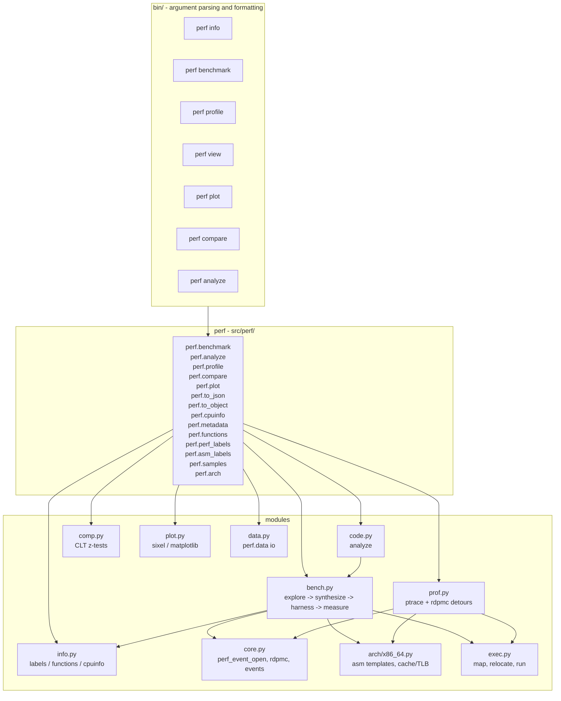
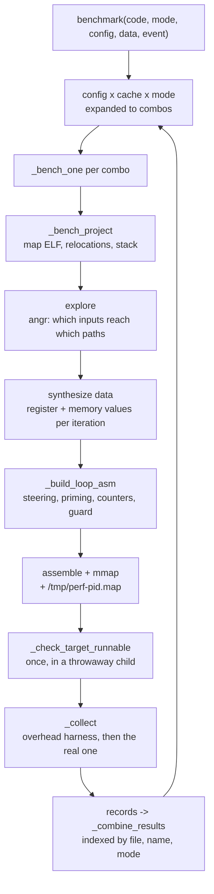

## Architecture

The library is one library and seven commands. Everything a command does is a
function in `src/perf/`, re-exported from `perf`, so `import perf` is the whole
API and the CLI adds nothing but argument parsing, formatting and `--json`.



### `benchmark`

One call is: expand the config into concrete combinations, run each one, tag
the columns, concatenate.



- `analyze` reuses exploration but stops there: it disassembles the target and
  reports what the states say, per instruction, without measuring.
- `profile` does not use the harness at all — it patches the running process.
- `compare`, `plot` and `view` never touch a counter; they take the DataFrame
  the others produced.

### `analyze`

`analyze` follows the same first two steps as `benchmark` (map, explore,
attach the explored values) and then disassembles the target, one row per
instruction, with OSACA-modelled `latency`/`throughput` merged with whatever
was measured for that address. No JIT, no counters.

### `profile`

`profile` starts the program under `ptrace`, patches an `int3` at the entry so
the exec trap fires, and redirects every tracked address to a `rdpmc` detour
that appends to a ring buffer in the child's address space. The parent reads
the buffer back over `/proc/<pid>/mem`, so per-hit counts cost no signal and no
syscall in the child. Detour code is generated in `arch/x86_64.py`
(`build_profile_detour`, `relocate_detour_bytes`), including the RIP-relative
fixups a detour displaces.

### `view/plot`

`view` reshapes and aggregates a DataFrame; `plot` draws it (sixel in a
terminal, matplotlib to a file);

### `compare`

`compare` tests two variants with a CLT z-test on the mean and on the
geometric mean, and calls a difference significant only if both reject.

### `info`

`info` answers "what is in this file?": `.perf.label` sections (from
`lib/perf/`), functions from `angr.CFGFast`, and CPU topology from sysfs. It is
what every other command points users at when a target name does not resolve.

# API

All public entry points are re-exported from `perf`, so `import perf` is the
whole import. Anything the CLI can do, the API can do with the same `target` /
`asm` / `config` / `data` / `event` values — see [bin/README.md](../bin/README.md)
for the CLI reference (flags, `--config` / `--data` keys, events, the output
envelope, `.perfconfig`). `perf view` and `perf info` are CLI-only: they format
and list what `perf.benchmark` measures and `perf.metadata` describes.

Public API is `arch`, `benchmark`, `profile`, `analyze`, `compare`, `plot`,
`functions`, `perf_labels`, `asm_labels`, `samples`, `to_json`, `to_object`,
`cpuinfo`, `metadata`. `arch` resolves both an architecture name and a
project (`arch(project)` replaces the old `load(project)`); `cpuinfo.format_hz`
formats frequencies (`cpuinfo` replaces the old top-level `format_hz`);
`samples.nest`, `samples.spread`, `samples.parse`, `samples.metrics` and
`samples.is_record` are accessed through `samples` (replacing the old
top-level `nest`, `spread`, `parse`, `metrics`, `is_record`); `perf_labels`
replaces the old top-level `labels`. `perf.to_json` records `hostname`
(`info.hostname()`) alongside `cpu` in its `info` section.

## `target` and `asm`

`perf.benchmark` and `perf.analyze` take a binary target as `target` and a
raw asm snippet as `asm`: a `[file, target]` pair, or a raw asm snippet.
A `"file:target"` string is accepted as a shorthand for the pair form.

```py
target = ["a.out", "func"]  # function of a binary
target = ["a.out", ("hot_begin", "hot_end")]  # region of a binary
target = ["foo.s", "foo"]  # label of an assembly source
target = ["foo.s", ("foo", "bar")]  # region of an assembly source
target = "a.out:func"  # shorthand string for the pair form
asm = "mov eax, 42"  # raw asm snippet (no file)
```

## `argv` and `env`

`benchmark(argv=..., env=...)` gives the target a process to run as. The CLI
spells it `-- ARGS...` after `--env KEY=VALUE`, so
`perf benchmark /usr/bin/tree:main -m latency -- /path/to/folder` measures
`main(2, ["/usr/bin/tree", "/path/to/folder"], envp)`. The Python `argv` is the
same list spelled out, including `argv[0]`:

```py
df = perf.benchmark(
    target=["/usr/bin/tree", "main"],
    mode=["latency"],
    argv=["/usr/bin/tree", "/path/to/folder"],
    env=["LANG=C.UTF-8"],
)
```

`Elf.setup_argv` (`src/perf/exec.py`) writes the strings, `argc`, `argv`,
`envp` and an `AT_*` auxiliary vector into the mapped stack, and
`arch.argv_asm` (`src/perf/arch/x86_64.py`) puts `argc`/`argv`/`envp` into
`rdi`/`rsi`/`rdx` before the call and points `rsp` at the image for the
duration of the loop. The words are `argv` as a shell would pass them, so the
first is `argv[0]`; an empty list means `argv[0]` is `file` and `argc` is 1. `--data.rdi`, `--data.rsi` and
`--data.rdx` are refused while `argv` is set: the ABI already decides those
three.

## Synopsis

```py
import perf

# benchmark: a mode is a list, events/config/data mirror the CLI flags
df = perf.benchmark(target=["a.out", "func"], mode=["latency"], event=["duration_time"])
df = perf.benchmark(
    target=["a.out", ("hot_begin", "hot_end")],
    mode=["latency"],
    event=["topdown-*"],
    data={"regs": {"rdi": 15}},
)
df = perf.benchmark(
    target=["/usr/bin/tree", "main"],
    mode=["latency"],
    argv=["/usr/bin/tree", "/path/to/folder"],
)
df = perf.benchmark(asm="mov eax, 42", mode=["latency"], event=["cycles"])
df = perf.benchmark(target=["a.s", "myfunc"], mode=["latency"])
df = perf.benchmark(target=["foo.s", ("foo", "bar")], mode=["latency"])
df = perf.benchmark(
    target=["a.out", "func"],
    mode=["latency", "throughput"],
    config={"dcache": ["hot", "cold"]},
)
df = perf.benchmark(
    asm="mov rax, [rdi]",
    mode=["latency"],
    config={
        "code": [{"align": 1}, {"align": 32}],
        "thread": [[{"numa": 0, "affinity": 1, "priority": "normal"}]],
    },
)

# per-instruction analysis (index 0..n, one row per instruction)
df = perf.analyze(target=["a.out", "func"])
df = perf.analyze(target=["foo.s", ("foo", "bar")])
df = perf.analyze(
    target=["a.out", ("hot_begin", "hot_end")], column=["assembly", "encoding"]
)
df = perf.analyze(target=["a.out", "func"], column=["data*"])
df = perf.analyze(target=["a.out", "func"], column=["*"])
df = perf.analyze(target=["a.out", "func"], filter="latency > 4")
df = perf.analyze(asm="mov rax, rdi", results=[measured])
df = perf.analyze(target=["a.out", "func"], data={"regs": {"rdi": 15}})
df = perf.analyze(target=["a.out", "func"], filter="15 in `data.rdi`")
df = perf.analyze(target=["a.out", "func"], setup="init", teardown="fini")

# labels of an assembly source as (name, position, size) in the file
print(perf.asm_labels("foo.s"))
print(perf.perf_labels)
print(perf.samples)

# relocatable object of the measured target
path = perf.to_object(code=["a.out", "func"], path="bench.o")
path = perf.to_object(code=["a.out", ("hot_begin", "hot_end")], path="region.o")
json = perf.to_json(df, indent=4)

# binary/cpu metadata (perf_labels, functions, hostname)
cpu = perf.cpuinfo()
print(perf.cpuinfo.format_hz(cpu["freq"].iloc[0]))
meta = perf.metadata("a.out")

# live profiling (labels, functions, hex addresses or (begin, end) regions)
df = perf.profile(cmd=["./a.out"], event=["cycles"], target=["hot"])
df = perf.profile(cmd=["./a.out"], event=["cycles"], target=["func"])
df = perf.profile(
    cmd=["./a.out"], event=["cycles"], target=[("work_begin", "work_end")]
)

# compare
cmp = perf.compare(df, events=["cycles"], baseline="base")

perf.plot(df, type=["ecdf"], event=["cycles"])
```

`data` accepts the flat (`{"rdi": 15}`) and the grouped (`{"regs": {"rdi": 15},
"mem": {...}}`) forms interchangeably. `mode` is required in the Python API;
the CLI defaults to both modes.

# Examples

Every command below was run on this machine (x86-64, Linux 6.x, Ubuntu 23.04,
Python 3.11) and the output is what it printed. `cycles` and `instructions` need
user-space `rdpmc`; the rest work without it.

Work in one directory:

```sh
git clone https://github.com/perf-labs/perf.git && cd perf
pip install -e .
mkdir -p /tmp/work && cd /tmp/work
cp -r ~/perf/lib .          # the zero-instruction code markers
gcc --version               # the fixtures below are C and C++
```

## A binary to measure

```c
// fizz.c
#include "perf/perf.h"

int add42(int x) { return x + 42; }

const char *func(int n) {
    PERF_LABEL(fizz_begin);
    const char *r = "Unknown";
    if (n % 15 == 0) r = "FizzBuzz";
    else if (n % 3 == 0) r = "Fizz";
    else if (n % 5 == 0) r = "Buzz";
    PERF_LABEL(fizz_end);
    return r;
}

int hot(int n) {
    PERF_LABEL(hot_begin);
    int s = 0;
    for (int i = 0; i < n; ++i) s += i;
    PERF_LABEL(hot_end);
    return s;
}

int main(void) { return func(15)[0] + add42(1) + hot(10); }
```

```sh
gcc -O2 -I lib -o fizz fizz.c
./fizz; echo $?     # 158, the first character of "FizzBuzz"
```

`PERF_LABEL` emits no instructions (see [lib/README.md](lib/README.md)); it
marks a spot so `perf benchmark` and `perf profile` can target it.

## What is in this file

Everything you can measure is listed, with the address you would pass:

```sh
$ perf info fizz | head -6
kind  begin     end       size  name
label  0x401174  0x401174        fizz_begin
label  0x4011a6  0x4011a6        fizz_end
label  0x4011e4  0x4011e4        hot_begin
label  0x4011f9  0x4011f9        hot_end
func   0x4011e0  0x401204    36  hot

$ perf info fizz | grep func
func   0x4011e0  0x401204    36  hot
func   0x401170  0x4011d6   102  func
func   0x401160  0x401168     8  add42
```

## A function

```sh
$ perf benchmark fizz:func -m latency -e cycles,instructions --data.arg0=15
file            name       mode     config.backend.loop.probes  ...  data.arg0  cycles  instructions  iterations  samples  operations  duration_time
fizz@2cd68638   func  latency                            3.00  ...      15.00  168254           97           100        0           1         3.00         9.00
fizz@2cd68638   func  latency                            3.00  ...      15.00  168254           98           100        1           1         3.00         9.00
fizz@2cd68638   func  latency                            3.00  ...      15.00  168254           99           100        2           1         3.00         9.00
```

`--data.arg0=15` is the argument (`rdi`); `arg0`/`arg1`/... are the registers
that pass arguments in the System V ABI. `cycles/operations` is 3 cycles for
the `15 % 15 == 0` path and 9 for the two multiplies it skips.

## An assembly snippet

No file at all — the argument is Intel-syntax assembly:

```sh
$ perf benchmark 'imul eax, 0' -m latency -e cycles,instructions
name      mode      config.backend.unroll.count  ...  operations  duration_time
imul ...  latency                            5.00  ...           1         3.00         1.00
```

One multiply is 1 cycle here; `duration_time` is the wall-clock the TSC saw.

## A region of a function

Narrow the target to the part you suspect, with the labels from the same file:

```sh
$ perf benchmark 'fizz:hot_begin..hot_end' -m latency -e cycles --data.arg0=10
file           name              mode     ...  data.arg0  cycles  iterations  samples  operations  duration_time
fizz@2cd68638  hot_begin..hot_end  latency  ...      10.00   43371         100        98           1         6.00
```

The same loop as a whole is `perf benchmark fizz:hot -m latency --data.arg0=10`;
the difference between the two is the setup and the call.

## Sweeping the input in one run

A comma-separated value sweeps; a repeated flag does not:

```sh
$ perf benchmark fizz:func -m latency -e cycles --data.arg0=[1,3,5,15]
```

gives one row per value, each with its own path through the branches, and the
`data.arg0` column says which is which. `--data.arg0=15` with no brackets is a
single measurement.

## C++ member functions

`perf benchmark` calls the target, so a member function needs `this` in `rdi`
and the object fields at the addresses the code dereferences. Give it an object
of its own — an address for `this` plus the field bytes — with `--setup` /
`--teardown` restoring the globals between iterations. See
[Member functions](../bin/README.md#member-functions) for the full example:

```sh
$ g++ -O2 -I lib -o counter counter.cpp
$ perf benchmark 'counter:Counter::member(long)' -m latency \
    -e cycles,instructions --setup counter:setup --teardown counter:teardown \
    --data.rdi=0x42000000000 --data.rsi=1000 \
    --data[0x42000000000:]=1 --data[0x42000000008:]=3
```

The target is the demangled name exactly as `perf info` prints it.
`--data[ADDR:]=BYTES` writes the fields (`value` at `this+0`, `step` at
`this+8`). The target alone is `counter:member_begin..member_end` with the same
data.

## libc.so

A shared library is a target like any other; `perf info` lists its exported
symbols. An indirect function resolves to the implementation the loader picked
for *this* CPU, so this is the `strlen` this machine runs, not a reference one.

`strlen` needs a pointer, so give it one with `--data`:

```sh
$ LIBC=/usr/lib/x86_64-linux-gnu/libc.so.6
$ perf benchmark "$LIBC:strlen" -m latency -e cycles \
    --data.rdi=0x4200000000 --data[0x4200000000:]=hello
file               name    mode     ...  cycles  operations  duration_time
libc.so.6@c3a14ee6 strlen  latency  ...    346.00           1       116.00
```

Sweep the length to see the per-byte cost:

```sh
$ perf benchmark "$LIBC:strlen" -m latency -e cycles \
    --data.rdi=0x4200000000 --data[0x4200000000:]=aaaaaaaaaaaaaaaa
libc.so.6@c3a14ee6 strlen latency ...  364.00 ...   # 16 bytes
```

Two pointers, a length:

```sh
$ perf benchmark "$LIBC:strcpy" -m latency -e cycles \
    --data.rdi=0x4200000000 --data.rsi=0x4200001000 \
    --data[0x4200000000:]=0123456789abcdef \
    --data[0x4200001000:]=fedcba9876543210
libc.so.6@c3a14ee6 strcpy latency ...  ...            # works
```

Use `--data[ADDR:]=` (with the colon) to write a run of bytes; without it the
harness has no contents for the address and the call faults, which is reported
as such rather than as a wrong number.

## libstdc++.so

Same thing with the C++ ABI: pass the demangled name, and the arguments in the
registers that pass them.

```sh
$ LIBCXX=/usr/lib/x86_64-linux-gnu/libstdc++.so.6
$ perf benchmark "$LIBCXX:std::locale::_S_normalize_category(int)" \
    -m latency -e cycles --data.rdi=8
libstdc++.so.6@a8d61b97 std::locale::_S_normalize_category(int) latency ...
```

`perf info $LIBCXX | head` lists 6,000 exported symbols; the version suffix
(`@@GLIBCXX_3.4`) is not part of the name you pass. The mangled name does not
resolve — pass the demangled one.

## A program in /usr/bin

`main` of an installed program is a target like any other:

```sh
$ perf benchmark /usr/bin/ls:main -m latency -e cycles
ls@34eda017 main latency  3.00  10.00  0.01  unpredictable  ...

$ perf benchmark /usr/bin/id:main -m latency -e cycles
id@3f477152 main latency  3.00  10.00  0.01  unpredictable  ...
```

This works for a position-independent program. A distro build that is not
(`/usr/bin/gcc`, most system tools) is linked at `0x400000`, which is where this
process already is, so the run stops with the reason instead of overwriting
the process:

```sh
$ perf benchmark /usr/bin/gcc:main -m latency
cannot map '/usr/bin/x86_64-linux-gnu-gcc-12' (resolved from '/usr/bin/gcc')
at 0x400000-0x556000: this process is already using 0x400000-0x41f000. A
non-PIE executable can only be mapped at the address it is linked at ...
$ perf info /usr/bin/gcc | head -3     # still works, it does not map anything
kind  begin     end       size  name
func  0x48de50  0x48df77   295  _obstack_newchunk
func  0x48de30  0x48de49    25  _obstack_begin_1
```

A function of a program you build yourself with `-fPIE -pie` has no such
problem.

## A program with its own arguments

Everything after `--` is the program's `argv`, the way a shell passes it:

```sh
$ perf benchmark /usr/bin/ls:main -m latency -e cycles -- /tmp/work
ls@34eda017 main latency  3.00  10.00  0.01  unpredictable  ...

$ perf benchmark /usr/bin/tree:main -m latency -- /home
tree@b3c9c390 main latency  3.00  10.00  0.01  predictable  ...
```

The words after `--` are `argv` exactly as a shell would pass them, so the first
one is `argv[0]` and that call is `main(2, ["/usr/bin/tree", "/home"], envp)`.
A bare `--` with nothing after it means `argv[0]` is the file you named and
`argc` is 1. `argc` goes in `rdi`, `argv` in `rsi` and `envp` in `rdx`, and the
strings, the vectors and the auxiliary vector are written into the harness's own
stack, so `getauxval()` answers for the image being measured. That stack is
laid out the way the kernel lays one out — the vectors at the stack pointer and
the strings above them, all of it above the pointer `main` starts from — so a
`main` with a frame of any size runs on clear stack of its own.

Whether a program's `main` survives being called on its own is the program's
business: `ls`, `id` and `tree` return, `cat` reads its standard input and never
comes back, and a function that dereferences a null pointer faults before it
does anything. A target that cannot run on its own is named and refused before
any measurement starts, rather than taking the process down with it:

```sh
$ perf benchmark a.out:crash -e cycles
'crash' faulted with a segmentation fault (SIGSEGV) when called on its own, so it cannot be measured in isolation ...
```

A method that needs an object someone else built is a different case: the data
it walks is *discovered*, not supplied. `q.o` has no `map::find` constructor —
the compiler elided it — so `unordered_map::find` runs against a container
nobody ever filled. The exploration already knows which register is the object
and which addresses it reads, so the harness lays those pages out and the method
is measured with no set-up at all:

```sh
$ perf benchmark q.o:map::find -e cycles
q.o@76a4e8ea map::find latency  3.00  10.00  0.01  predictable  hot  hot  hot  hot  ...  4.46ns
```

The `data.*` columns are that world: the keys it is asked for, and every cell
the walk touched (`data.0x4100010000` and its neighbours above are the
`unordered_map`'s own fields, `data.rsi` the keys). Each explored state is
replayed once before it is measured, and a state whose data does not come back
— a chain that walks into a cycle the exploration only left because one of its
reads was still symbolic — is dropped rather than allowed to hang the harness.
If every state is like that, the same addresses with nothing in them (an empty
container) are tried next. `--data` and `--setup` still win: whatever you pass
is what runs.

Benchmark the function a program spends its time in instead, or a `PERF_LABEL`
region around it.

Add to the environment with `--env`, repeated:

```sh
$ perf benchmark /usr/bin/ls:main -m latency --env LC_ALL=C -- /tmp/work
```

With no `--env` the environment is empty (`envp[0] == NULL`), the same as
`env -i`.

## Per-instruction view

`perf analyze` disassembles the target and never runs it, one row per
instruction, with the modelled cost of each:

```sh
$ perf analyze fizz:func --data.arg0=15 -e assembly,latency,throughput
assembly                                  latency throughput
endbr64
imul eax, edi, 0xeeeeeeef
lea rdx, [rip + 0xe83]    1.00    0.20
add eax, 0x8888888        1.00    0.20
cmp eax, 0x11111110       1.00    0.20
jbe .L4011a6
imul eax, edi, 0xaaaaaaab
```

With the default column set you also get the encoding, the address and the
`data.*` values the explored state puts in each register:

```sh
$ perf analyze fizz:hot_begin..hot_end --data.arg0=10 --filter 'latency > 0'
index file          name               address  encoding size latency throughput assembly      data.rdi
0     fizz@2cd68638 hot_begin..hot_end 0x4011e4 85 ff    2    1.00    0.20       test edi, edi [10]
2     fizz@2cd68638 hot_begin..hot_end 0x4011e8 31 c0    2    1.00    0.20       xor eax, eax  [10]
3     fizz@2cd68638 hot_begin..hot_end 0x4011ea 31 d2    2    1.00    0.20       xor edx, edx  [10]
5     fizz@2cd68638 hot_begin..hot_end 0x4011f0 01 c2    2    1.00    0.20       add edx, eax  [10]
6     fizz@2cd68638 hot_begin..hot_end 0x4011f2 83 c0 01 3    1.00    0.20       add eax, 1    [10]
```

`latency`/`throughput` come from an instruction-latency model (OSACA), not from
a measurement — `perf analyze` never counts anything. To see measured per-ip
counts, join a profile:

```sh
$ perf benchmark fizz:hot -m latency -e cycles -o data/
$ perf profile -t hot -e cycles -o profile.json -- ./fizz
$ perf analyze fizz:hot -- profile.json     # adds the measured per-ip events
```

## Live profiling

`perf profile` runs the program and counts at each tracked address, with no
harness and no per-call overhead beyond the `rdpmc` it reads:

```sh
$ perf profile -t func -e cycles -o profile.json -- ./fizz
tracked 1 samples -> profile.json
```

Targets are labels, function names, hex addresses or `begin..end` regions; a
label or a region gets a trampoline, so `--target hot_begin..hot_end` costs
nothing per instruction. By default main is tracked.

## Compare two builds

```sh
$ perf benchmark a.old:func -n base --data.arg0=15 -m latency -e cycles -o old/
$ perf benchmark a.new:func -n cand --data.arg0=15 -m latency -e cycles -o new/
$ perf compare -b base -- old/ new/
baseline    challenger    mode     event               diff  ci_low ci_high p_value alpha  result
base-2f7fc9ad cand-2f7fc9ad latency cycles/operations -0.85% -6.57%  +5.23%  0.7795  0.05  insignificant
```

A difference is only called significant when a CLT z-test rejects on both the
arithmetic and the geometric mean. `-b` takes the name `perf benchmark -n`
recorded; `perf compare` prints the names it found if yours does not match.

## Look at the results

```sh
$ perf benchmark fizz:func -m latency -e cycles -o data/
$ perf view -s min,median,p99 -- data/          # a table
$ perf plot -t ecdf -e cycles -o plot.png -- data/   # a picture
$ perf plot -e cycles -- data/                  # sixel, if the terminal has it
```

## Top-down attribution

Which microarchitectural bound is this?

```sh
$ perf benchmark fizz:add42 -m latency -e 'topdown-*' --data.rdi=1 --config.samples=1
file            name   mode     topdown-retiring  topdown-bad-spec  topdown-fe-bound  topdown-be-bound
fizz@2cd68638   add42  latency             4.00            15.00                             1.00
```

The wildcard expands to the four slots, and they are read together with the
`slots` leader so the four numbers are from the same window. `add42` retires
4 cycles and touches the front end for 1 — the right answer for a one
instruction leaf.

Two caveats, both about the machine rather than the tool. The slots exist only
on Intel CPUs that have them; elsewhere the run stops and says so instead of
reporting zeros. And on a hybrid CPU the kernel will not always schedule all
four at once, in which case the ones it dropped come back empty — system `perf`
refuses the same group outright with *"events in group from different hybrid
PMUs"*, so read the empty slots as "not measured", not as "zero". Measuring
them one at a time with a repeated `-e` always works.

## Sweep cache, TLB and branch state

One axis at a time, everything else pinned:

```sh
$ perf benchmark fizz:func -m latency -e cycles \
    --data.arg0=15 --config.dcache=hot,warm,cool,cold
$ perf benchmark fizz:func -m latency -e cycles \
    --data.arg0=15 --config.branch=predictable,unpredictable
$ perf benchmark fizz:func -m latency -e cycles \
    --data.arg0=15 --config.code=1,32
```

The `config.*` columns say which alternative a row is, so the output is
self-describing. See [studies/README.md](studies/README.md) for the notebooks
that use this to answer top-down questions.

## The same from Python

Everything above is one call, and the DataFrame is the same either way:

```py
import perf

df = perf.benchmark(
    target=["fizz", "func"],
    mode=["latency"],
    event=["cycles"],
    data={"rdi": 15},
    config={"dcache": "hot, cold"},
)
print(df[["config.dcache", "cycles", "duration_time"]])

df = perf.benchmark(
    target=["/usr/bin/ls", "main"],
    mode=["latency"],
    argv=["/usr/bin/ls", "/tmp/work"],
)
df = perf.benchmark(
    target=["/usr/lib/x86_64-linux-gnu/libc.so.6", "strlen"],
    mode=["latency"],
    event=["cycles"],
    data={"rdi": 0x4200000000},
)
instr = perf.analyze(target=["fizz", "hot_begin..hot_end"], data={"rdi": 10})
print(instr[instr.latency > 0])
cmp = perf.compare(df, events=["cycles"], baseline="base")
perf.plot(df, type=["ecdf"], event=["cycles"])
```

See [src/README.md](src/README.md) for the API and
[bin/README.md](bin/README.md) for every flag.

## How it works

### 1. A harness around the target

`perf benchmark` JITs a loop around the measured snippet. `latency`
times one call per iteration, `throughput` times the whole loop.
`r8` is the trip count, `r9`/`r10` are the input/output cursors,
`{t0}`/`{t1}` are the counter reads. The prologue keeps `rsp` 16-byte
aligned so the `call` into the target is ABI-correct
(`src/perf/arch/x86_64.py: _BENCH`):

```asm
; latency: per-iteration sample
mov r8, [rdi]                 ; iterations
.perfloop:
    mov rdi, [r9 + 8*r8]      ; per-iteration slot
    ; {data}  steer: values + cache/TLB tier for this iteration
    ; {data2} prime: regs for this iteration (after t0, see below)
    ; {t0}    counter prologue (below)
    ; {code}  guard + call rax (+ lfence) / raw asm snippet
    ; {t1}    counter epilogue (below)
    dec r8
    jnz .perfloop

; throughput: one sample for the whole loop
    ; {data}  steer once
    ; {data2} explicit register reload
    ; {t0}
.perfloop:
    ; {data_iter} values + regs per iteration
    ; {code}
    dec r8
    jnz .perfloop
    ; {t1}
```

Example — what you ask vs what runs:

```sh
perf benchmark a.out:func -m latency -e cycles
# -> latency loop above, {code} = guard + call func, timed per iteration

perf benchmark a.out:func -m throughput -e cycles
# -> throughput loop above, one sample for all iterations

perf benchmark 'imul eax, 0' -m latency
# -> same loops, {code} = the raw snippet (no call)
```

Only the target's own instructions are ever reported. `perf analyze`
disassembles the target itself, never the harness, and the harness's own
timing reads, cache/TLB steering, register priming and call sequence are
subtracted by the differential rather than attributed to the target. The one
harness instruction deliberately inside the measured window is the per-iteration
register priming (`{data2}` in latency, `{data_iter}` in throughput): it has to
run after `rdtsc`/`rdpmc`, which clobber `rax` and `rdx`, so that the target
sees its inputs. It is identical in the `nop` baseline, so it cancels.

### 2. Counters without syscalls, overhead subtracted

Counter reads (`timing()`) need no syscall — `duration_time` uses
`rdtsc`/`rdtscp`, everything else uses `rdpmc` (needs
`echo 2 | sudo tee /sys/devices/{cpu_core,cpu_atom}/rdpmc` once):

```asm
; t0 (duration_time, single event; baseline kept in r11, r10 = output cursor)
push rcx
lfence
rdtsc
mov r11, rax
lfence
pop rcx
; t1
push rcx
rdtscp
lfence
sub rax, r11               ; delta
mov [r10], rax
add r10, 8
pop rcx
; rdpmc events: same shape with `mov ecx, <pmc-index> + lfence + rdpmc + lfence`
; (the read is ordered before and after the window; `rdpmc` alone is only
;  ordered against other counter reads)
; multi-event: one baseline reg per event, `mov [r10+8*i], rax` + `add r10, 8*N`
```

Overhead is subtracted differentially: `loop` measures a `nop`
(`call_seq_nop_asm` for functions) and subtracts its median; `unroll`
measures N vs 2N copies (`backend.unroll.count`, default `5`) and divides by
N. Trip count auto-calibrates (`iterations.min/max`, default `100/1000000`)
to a target relative standard error (`backend.<name>.target`, default
`0.005`) unless `iterations` is pinned. The resolved backend and the
options it ran with are written back into `backend`, keyed by the backend
name (`{"loop": {...}}`), so the `output` rows carry them.

Example — check what the harness did:

```sh
perf benchmark a.out:func --debug 2>&1 | head -50
# prints config, found solutions, synthesized data, full asm, per-run rows

perf benchmark a.out:func --config.iterations=1000
# pin the trip count instead of auto-calibrating

perf benchmark 'rdtsc' -m latency --backend loop
# force the loop backend (snippets default latency -> unroll)
```

Each run is wrapped in the placement guards of `thread` — `_numa_guard`
(`set_mempolicy(MPOL_BIND, node)`, best effort), `_affinity_guard`
(`sched_setaffinity`) and `_priority_guard` (nice) — which restore whatever
the process had before once the runs are done.

```sh
perf benchmark a.out:func --config.thread.affinity=2  # pin to cpu 2
perf benchmark a.out:func --config.thread.numa=1       # bind memory to node 1
```

### 3. Inputs are discovered, not guessed

Before measuring, `bench` discovers what to feed the snippet:

Symbolic exploration (`src/perf/bench.py: explore`): the target (function, `(begin, end)` region, or `asm`
snippet) is lifted to VEX IR and explored with `angr`. Functions use
`call_state` so the ABI prototype is honored, anything else uses
`blank_state` plus a mapped stack (`stack.size/align`); `--setup` asm is
assembled at `_SETUP_BASE` (`0x1000000`) and prepended as a jump stub to the
target. All general purpose registers start as symbolic (`claripy.BVS`),
explicit `--data` scalar registers are constrained (`== value`; list values
stay symbolic and are sampled later), explicit `--data` pages are mapped,
and every memory read/write is recorded with `mem_read`/`mem_write`
breakpoints. Exploration runs `simgr.explore(find=ret_addrs)` (every `ret`
in the function, else the region/snippet end), so one run covers every code
path. Raw `asm` goes through the same path via `explore_asm`: the snippet
is assembled at `_SETUP_BASE`, unknown registers are pinned to scratch
pages (`_ASM_SCRATCH_BASE 0x4100001000 + idx*0x1000`) so pointer derefs do
not fault, and `find=[base+len(encoding)]`.

Low-level example — this snippet has two paths. Exploration finds both
`ret`s, so one benchmark run covers both branches automatically:

```asm
cmp edi, 0
jle .else
mov eax, 1
ret
.else:
mov eax, 2
ret
```

```py
# conceptually what explore() sets up (src/perf/bench.py:explore)
state.registers.store("rdi", claripy.BVS("rdi", 64))  # every GPR symbolic
state.inspect.b("mem_read", when=BP_AFTER, action=record)  # same for mem_write
simgr.explore(find=[ret1, ret2])  # both rets
# found[0] constraints: rdi > 0,  bbl_addrs: [entry, .then]
# found[1] constraints: rdi <= 0, bbl_addrs: [entry, .else]
```

Solving (`solve()`): each found state is solved with the SMT solver.
Registers and every recorded `(addr_sym, length_sym, value_sym)` are
`solver.eval`'d to concrete models; a symbolic return value (`If`-tree over
`BVV` leaves) forks the state once per leaf. For
`branch.*.mem = predictable` addresses the solver also records
`branch_deps` (which registers/memory each conditional branch consumes via
`cond_branch_analysis`), so predictable runs can pin exactly those inputs.

Continuing the example:

```py
solver.eval(found[0].regs["rdi"])  # -> 1,  constraint rdi > 0
solver.eval(found[1].regs["rdi"])  # -> 0,  constraint rdi <= 0
models = [
    {"regs": {"rdi": 1}, "reads": [], "writes": []},
    {"regs": {"rdi": 0}, "reads": [], "writes": []},
]
```

`perf analyze` reports the same states: `data.<reg>` is the solved value of
each register a state pins (its `inputs`, i.e. the registers the target is
given rather than the ones the exploration had to pin to keep going) and
`data.<addr>` the value a state has at an address it read or wrote, keyed by
the instruction address. The per-instruction `accesses` recorded alongside
`reads`/`writes` (address, instruction, load or store) are what makes that
mapping possible without a second exploration. Without `column`, `analyze`
returns `file,name,index,address,encoding,size,latency,throughput,assembly`
plus every `data*` column; pass `column` to pick any other set (`"*"` for
all of them, a name that is not there is an error). The rows are every
instruction the target disassembles to; the exploration only supplies the
state columns, so a call the emulator cannot follow never cuts the listing
short half way through a function.

With memory, `mov rax, [rdi]` records one read; solving yields a concrete
address/value pair, e.g. `reads: [(0x4100001000, 8, 123)]` where
`0x4100001000` is the pinned scratch page for the symbolic `rdi`.

Try it — constrain the explored state yourself:

```sh
# default: both paths sampled automatically
perf benchmark a.out:func -m latency -e cycles

# pin one input: only that state is explored/measured
perf benchmark a.out:func --data.rdi=15 -m latency -e cycles

# sweep three inputs in one run (one measurement per value set)
perf benchmark a.out:func --data.rdi=[1,3,5] -m latency -e cycles
perf analyze a.out:func --data.rdi=15
```

VEX: the executed basic-block addresses (`bbl_addrs` history, plus the block
each state stopped in) select the measured code. Static tables are found
by scanning RIP-relative/displacement operands in the range and keeping
the ones the exploration recorded as *data* (`_static_table_addrs`): a
memory access performed by the very instruction that also exits the block
is a `jmp`/`call` target table, not data, so jump tables stay out of the
cache model and the harness never writes over them.
Data synthesis (`_per_iter_data`): models become a per-iteration table (`_per_iter_data`: one
row per register, plus one value row per address, `K = max(iterations+1,
2*addresses)` columns indexed backwards as `r8 = iterations - it`). Each
iteration picks one model — round-robin (`it % n`) when `predictable`,
`rng.randrange(n)` when `unpredictable` — overlays explicit
`--data.rdi` / `--data[addr]` values, and the harness reads the table via
`prime`/`steer` asm. With no `--data`, sampling cycles through all
paths/values, so branches are covered automatically. When one model and
only scalar data are in play the table is filled in one vectorized pass
instead of per iteration.

```asm
; prime_asm: regs for this iteration (r8 = iterations - it)
push r14
movabs r14, 0x...            ; base of the rdi column
mov rdi, [r14 + r8*8]
pop r14

; _value_write_loop: memory values for this iteration
xor r15, r15
.perfwrite:
    movabs r14, 0x...        ; evict-table: target addresses
    mov r12, [r14 + r15*8]
    movabs r14, 0x...        ; evict-table: value-column pointers
    mov r14, [r14 + r15*8]
    mov r13, [r14 + r8*8]    ; value for iteration r8
    mov [r12], r13
.perfwritedone:
    inc r15
    cmp r15, 0x2
    jne .perfwrite
```

### 4. Cache, TLB and branch state per iteration

Cache eviction (`evict()`): every address gets a tier per iteration (`L1d`/`L2`/`L3`/
`DRAM`, plus `L1i` and `TLBd`/`TLBi`). `hot` keeps everything in `L1`,
`cold` flushes to `DRAM`; per-tier hit rates or per-address levels split
addresses across tiers. `steer_asm` writes the values first, then emits
(`evict()`):

```asm
mov rax, [0x...]             ; L1d: touch + fence (stays resident)
mfence
mov r12, 0x...               ; L2: flush, fence, prefetch into L2
clflushopt [r12]
mfence
prefetcht1 [r12]
mov r12, 0x...               ; L3: flush, fence, prefetch into L3
clflushopt [r12]             ; (cldemote when the CPU has it)
mfence
prefetcht2 [r12]
mov r12, 0x...               ; DRAM: flush only
clflushopt [r12]
mfence
; 16x pause                  ; settle
```

Example — one target, two opposite memory worlds:

```sh
# everything served from L1
perf benchmark 'mov rax, [rdi]' --config.dcache=hot -e cache-misses,cycles

# same code, flushed to DRAM every iteration
perf benchmark 'mov rax, [rdi]' --config.dcache=cold -e cache-misses,cycles

# compare L2 vs L3 residency
perf benchmark a.out:func --config.dcache=warm,cool -e cycles
```

The `TLBd`/`TLBi` tiers are orthogonal to the cache tier of the same
address, so an address can be `L1d` hot and `TLBd` cold at the same time
and gets both the cache op and a ring-3 `mprotect` protection toggle (a
non-privileged `invlpg` alternative, `tlb_inval_asm`):

```asm
mov rdi, 0x...               ; page base
mov rsi, 0x2000              ; 2 adjacent pages
mov rdx, 0x7                 ; PROT_RWX
mov rax, r8                  ; the loop counter
and rax, 1                   ; its parity flips the protection ...
shl rax, 1                   ; ... by 2 for code pages, by 4 for data
sub rdx, rax                 ; PROT_RWX <-> PROT_RX / PROT_RW
mov rax, 10                  ; __NR_mprotect
syscall
```

One syscall per iteration, not a `PROT_NONE`/`PROT_RWX` pair, and the
protection the loop counter selects alternates on its own: the page stays
present, readable and writable in both states (code pages drop `PROT_W`,
data pages drop `PROT_X`), so the target only pays the page walk it was
asked to measure. Both ends of the pair must change the pte or the kernel
makes `mprotect` a no-op and the translation is never dropped, so the two
protections differ in exactly one bit and the shift is that bit's index.
Every page within 64 pages of each other (up to 512 pages per
call) is coalesced into one `mprotect` range, and the harness maps those
ranges up front as one mapping each, so a target that touches many pages
pays one syscall per cluster instead of one per page. A range never covers
a page the harness does not own (a code page steered with a different
protection, or a page that is already taken), the whole block shares a
single push/pop prologue, and the harness restores `PROT_RWX` on every
steered page once the loop is done.

`dtlb` applies to the addresses the target loads/stores and `itlb` to the
pages its code lives at (as does `icache`, via the code's data-hierarchy
line). Both take a global rate (`"hot"` or
`{"hit_rate": 50}`) and, per address or register, a rate of their own
(`{"dtlb": {"0x42000000000": {"hit_rate": 0}}}`) on top of it — the tier
names are the internal ones and are not config keys.

Branch data (`branch`): selects predictability globally or per `regs`/`mem`
entry, and takes exactly two values. `predictable` replays models/values in
order (`vals[it % len(vals)]`) and pins branch dependencies, so the target
sees the sequence it was solved with; `unpredictable` samples an index at
random, so the same binary measures both best-case and branch-miss-heavy
behavior without changing code.

```sh
# best case vs branch-miss-heavy, same binary
perf benchmark a.out:func --config.branch=predictable,unpredictable \
  -e cycles,branch-misses
```

### 5. Live profiling without a harness

`perf profile` (`src/perf/prof.py`) patches each tracked address with a 5-byte direct jump to a
trampoline that claims a slot in a shared per-process ring buffer and records
the counter deltas. A label detour looks like this:

```asm
pushfq                          ; keep flags out of the measured path
push rax
push rcx
push rdx
push r11
mov  r11, <ring_base>
mov  rax, [r11 + 8]             ; head
mov  rcx, rax
and  rcx, <cap_mask>
shl  rcx, <slot-stride-log2>    ; byte offset of the slot
lea  rdx, [rax + 1]             ; reserve slot
mov  [r11 + 8], rdx
lea  r11, [r11 + rcx + 64]      ; slot address (64-byte header at buf start)
mov  dword ptr [r11], <point_id>
mov  qword ptr [r11 + 8], rax   ; sequence number
lfence
mov  ecx, <pmc-index>
rdpmc                           ; raw counter (or rdtsc for duration_time)
shl  rdx, 32
or   rax, rdx
mov  [r11 + 16], rax
pop  r11
pop  rdx
pop  rcx
pop  rax
popfq
; <relocated original instructions>
jmp  <resume address>
```

The overwritten instructions are disassembled, relocated (RIP-relative
operands fixed up, short branches expanded to their rel32 forms), and emitted
between the recording block and the jump back, so the process resumes
exactly where it left off. Function entry patches additionally push the real
return address onto a shadow stack and rewrite the saved slot with the
trampoline's exit stub, so every `ret` is intercepted by one patch. The
1 MiB trampoline cave is mapped within 1 GiB (`2^30` bytes) of the binary; the original
file on disk is untouched.

Example — profile, then attribute:

```sh
perf info a.out                           # what can be tracked
perf profile -t func -e cycles -- ./a.out # one function, live
perf profile -t hot -e 'topdown-*' -- ./a.out # where is it bound?
perf analyze a.out:func -- profile.json   # join counts onto instructions
```

## References

- Manuals
  - Intel - https://www.intel.com/content/www/us/en/developer/articles/technical/intel-sdm.html
  - AMD - https://docs.amd.com/v/u/en-US/40332-PUB_4.08
  - ARM - https://developer.arm.com/documentation/ddi0487/latest
  - Apple - https://developer.apple.com/documentation/apple-silicon/cpu-optimization-guide

- Books
  - Performance Analysis and Tuning on Modern CPUs - https://github.com/dendibakh/perf-book/releases
  - The Art of Writing Efficient Programs - https://www.packtpub.com/product/the-art-of-writing-efficient-programs
  - Algorithms for Modern Hardware - https://en.algorithmica.org/hpc
   - CPU Performance Engineering - https://github.com/usamahz/cpu-performance-engineering
  - Computer Architecture - https://dl.acm.org/doi/book/10.5555/1999263
  - The Art of Assembly Language - https://www.plantation-productions.com/Webster/www.artofasm.com/Linux/HTML/AoATOC.html
  - SIMD for C++ Developers - http://const.me/articles/simd/simd.pdf
  - Memory Models - https://research.swtch.com/mm
  - Rust Atomics and Locks - https://marabos.nl/atomics
  - Data-Oriented Design - https://www.dataorienteddesign.com/dodbook
  - Hackers Delight - https://doc.lagout.org/security/Hackers%20Delight.pdf
  - A Primer on Memory Consistency and Cache Coherence, Second Edition - https://link.springer.com/content/pdf/10.1007/978-3-031-01764-3.pdf

- Publications
  - What Every Programmer Should Know About Memory - https://www.akkadia.org/drepper/cpumemory.pdf
  - The Microarchitecture of Superscalar Processors - https://courses.cs.washington.edu/courses/cse471/01au/ss_cgi.pdf
  - Producing wrong data without doing anything obviously wrong! - https://dl.acm.org/doi/10.1145/1508284.1508275
  - STABILIZER: Statistically Sound Performance Evaluation - https://people.cs.umass.edu/~emery/pubs/stabilizer-asplos13.pdf
  - Robust benchmarking in noisy environments - https://arxiv.org/abs/1608.04295
  - nanoBench: A Low-Overhead Tool for Running Microbenchmarks on x86 Systems - https://arxiv.org/abs/1911.03282
  - LIKWID: A lightweight performance-oriented tool suite for x86 multicore environments - https://www.cse.wustl.edu/~roger/566S.s21/05599200.pdf
  - The Linux Scheduler: a Decade of Wasted Cores - https://people.ece.ubc.ca/sasha/papers/eurosys16-final29.pdf
  - The Tail At Scale - https://www.barroso.org/publications/TheTailAtScale.pdf
  - Can Seqlocks Get Along With Programming Language Memory Models - https://www.hpl.hp.com/techreports/2012/HPL-2012-68.pdf
  - Cache-Oblivious Algorithms and Data Structures - https://erikdemaine.org/papers/BRICS2002
  - Memory-Centric Computing: Solving Computing`s Memory Problem - https://arxiv.org/abs/2505.00458
  - High-Precision Branch Target Injection Attacks Exploiting the Indirect Branch Predictor - https://indirector.cpusec.org
  - A Top-Down method for performance analysis and counters architecture - https://www.researchgate.net/publication/269302126_A_Top-Down_method_for_performance_analysis_and_counters_architecture
  - There’s plenty of room at the Top: What will drive computer performance after Moore’s law? - https://www.science.org/doi/10.1126/science.aam9744
  - C++ Design Patterns for Low-latency Applications Including High-frequency Trading - https://arxiv.org/abs/2309.04259
  - Semi-static Conditions in Low-latency C++ for High Frequency Trading: Better than Branch Prediction Hints - https://arxiv.org/abs/2308.14185
  - BHive: A Benchmark Suite and Measurement Framework for Validating x86-64 Basic Block Performance Models - https://adapt.cs.illinois.edu/papers/bhive.pdf
  - The Path of a Packet Through the Linux Kernel - https://www.net.in.tum.de/fileadmin/TUM/NET/NET-2024-04-1/NET-2024-04-1_16.pdf

- Metrics
  - Latency, Throughput, and Port Usage Information - https://uops.info
  - Latency, Memory Latency and CPUID dumps - http://instlatx64.atw.hu
  - Memory Latency Data - https://chipsandcheese.com/memory-latency-data
  - Core To Core Latency - https://github.com/nviennot/core-to-core-latency
  - Operation Costs in CPU Clock Cycles - http://ithare.com/infographics-operation-costs-in-cpu-clock-cycles
  - Microprocessor Trend Data - https://github.com/karlrupp/microprocessor-trend-data
  - Micro-architecture Metrics - https://dougallj.github.io/applecpu/firestorm.html
  - Top-Down Metrics - https://github.com/intel/perfmon/blob/main/TMA_Metrics-full.xlsx
  - Performance Monitoring Events - https://perfmon-events.intel.com
  - Performance Monitor Counters - https://www.amd.com/content/dam/amd/en/documents/epyc-technical-docs/programmer-references/58550-0.01.pdf
  - Measuring Reorder Buffer Capacity - https://blog.stuffedcow.net/2013/05/measuring-rob-capacity/

- Info
  - Instruction Reference - https://www.felixcloutier.com/x86
  - Instruction Matrix - https://github.com/google/highway/blob/master/g3doc/instruction_matrix.pdf
  - Instruction Tables: Lists of instruction latencies, throughputs and micro-operation breakdowns for Intel, AMD and VIA CPUs - https://www.agner.org/optimize/instruction_tables.pdf
  - Intel Intrinsics - https://www.intel.com/content/www/us/en/docs/intrinsics-guide/index.html
  - "RDNA4" Instruction Set Architecture - https://www.amd.com/content/dam/amd/en/documents/radeon-tech-docs/instruction-set-architectures/rdna4-instruction-set-architecture.pdf
  - Opcode and Instruction Reference - http://ref.x86asm.net
  - CPUID data repository - https://x86-cpuid.org
  - Encoding x86 Instructions - https://www-user.tu-chemnitz.de/~heha/hs/chm/x86.chm/x86.htm
  - Intrinsics Cheatsheet - https://db.in.tum.de/~finis/x86-intrin-cheatsheet-v2.1.pdf
  - Cardyak’s Microarchitecture Cheatsheet - https://docs.google.com/spreadsheets/d/18ln8SKIGRK5_6NymgdB9oLbTJCFwx0iFI-vUs6WFyuE
  - Cardyak’s Microarchitecture diagrams - https://drive.google.com/drive/u/0/folders/1W4CIRKtNML74BKjSbXerRsIzAUk3ppSG
  - x86docs - https://kib.kiev.ua/x86docs
  - Processor Information - https://sandpile.org
  - SIMD.info - https://simd.info
  - SIMD Instruction List - https://www.officedaytime.com/simd512e
  - Instruction Discovery And Analysis - https://explore.liblisa.nl
  - ```cpp
    Speed of light ......................... ~1 foot/ns
    1 cycle execution (4Gz).................... 0.25 ns
    L1 cache reference ......................... 0.5 ns
    L2 cache reference ........................... 3 ns
    Branch mispredict ............................ 3 ns
    L3 cache reference .......................... 10 ns
    Mutex lock/unlock ........................... 25 ns
    Main memory reference ......................  70 ns
    Send 2K bytes over 1 Gbps network ....... 20,000 ns  =  20 µs
    SSD random read ........................ 150,000 ns  = 150 µs
    Read 1 MB sequentially from memory ..... 250,000 ns  = 250 µs
    Round trip within same data-center ..... 500,000 ns  = 0.5 ms
    Read 1 MB sequentially from SSD .....  1,000,000 ns  =   1 ms
    Read 1 MB sequentially from disk .... 20,000,000 ns  =  20 ms
    Send packet CA->UK->CA ....          150,000,000 ns  = 150 ms
    ```

- Methodologies
  - Performance Analysis Methodology - https://www.brendangregg.com/methodology.html
  - Top-Down Microarchitecture Analysis Method - https://www.intel.com/content/www/us/en/docs/vtune-profiler/cookbook/2023-0/top-down-microarchitecture-analysis-method.html
  - Active Benchmarking - https://www.brendangregg.com/activebenchmarking.html
  - Micro Benchmarking - https://hpc-wiki.info/hpc/Micro_benchmarking
  - Recording Inferior’s Execution and Replaying It - https://sourceware.org/gdb/current/onlinedocs/gdb.html/Process-Record-and-Replay.html
  - Measuring Workloads With TopLev - https://github.com/andikleen/pmu-tools/wiki/toplev-manual
  - `cycle-by-cycle` micro-architectural introspection - https://gamozolabs.github.io/metrology/2019/08/19/sushi_roll.html

- Guides
  - Low Latency Tuning Guide - https://rigtorp.se/low-latency-guide
  - Optimizing Software in C++: An Optimization Guide for Windows, Linux and Mac platforms - https://www.agner.org/optimize/optimizing_cpp.pdf
  - Optimizing Subroutines in Assembly Language: An Optimization Guide for x86 platforms - https://www.agner.org/optimize/optimizing_assembly.pdf
  - Calling Conventions for different C++ compilers and operating systems - https://www.agner.org/optimize/calling_conventions.pdf
  - The Microarchitecture of Intel, AMD and VIA CPUs: An Optimization Guide for Assembly programmers and compiler makers - https://www.agner.org/optimize/microarchitecture.pdf
  - Is Parallel Programming Hard, And, If So, What Can You Do About It? - https://www.kernel.org/pub/linux/kernel/people/paulmck/perfbook/perfbook.html
  - RHEL Performance Guide - https://myllynen.github.io/rhel-performance-guide
  - Measuring Workloads with Top-down Microarchitecture Analysis - https://github.com/andikleen/pmu-tools/wiki/toplev-manual
  - Memory stabilizer - https://emeryberger.com/research/stabilizer/
  - Apple Silicon Guide - https://github.com/mikeroyal/Apple-Silicon-Guide
  - Envisioning a Simplified Intel Architecture - https://www.intel.com/content/www/us/en/developer/articles/technical/envisioning-future-simplified-architecture.html
  - Monitoring and Managing System Status and Performance - https://docs.redhat.com/en/documentation/red_hat_enterprise_linux/8/html/monitoring_and_managing_system_status_and_performance
  - Modern Microprocessors A 90-Minute Guide! - https://www.lighterra.com/papers/modernmicroprocessors
  - X3 Low Latency Quickstart - https://docs.amd.com/r/en-US/ug1586-onload-user/X3-Low-Latency-Quickstart
  - All Roads Lead to IPC: Rethinking CPU Performance Design - https://github.com/djiangtw/tech-column-public/blob/main/topics/computer-architecture/01-all-roads-lead-to-ipc.en.md
  - Bit Twiddling Hacks - https://graphics.stanford.edu/~seander/bithacks.html
  - C/C++11 mappings to processors - https://www.cl.cam.ac.uk/~pes20/cpp/cpp0xmappings.html
  - ELF Format - https://gist.github.com/x0nu11byt3/bcb35c3de461e5fb66173071a2379779
  - Switch lowering in GCC - https://xoranth.net/gcc-switch
  - `hotpachable` functions - https://github.com/google/orbit/wiki/Support-for-dynamically-instrumenting-hotpachable-functions
  - ```sh
    # System topology (apt install hwloc)
    lstopo # lstopo-no-graphics

    # CPU info (apt install util-linux)
    lscpu | grep -E ^CPU|^Model|^Core|^Socket|^Thread

    # Cache info
    lscpu | grep cache
    getconf -a | grep CACHE_LINESIZE

    # Numa nodes
    lscpu | grep -E ^NUMA

    # Topology
    lscpu -e

    # Huge pages
    cat /proc/meminfo | grep -i huge
    ```

- News / Docs
  - Linux News - https://lwn.net
  - Chips and Cheese - https://chipsandcheese.com
  - WikiChip - https://wikichip.org
  - CPUID - https://www.cpuid.com/news.html
  - CPU-World - https://www.cpu-world.com/index.html
  - Real World Tech - https://www.realworldtech.com
  - Tom`s Hardware - https://www.tomshardware.com
  - Wccftech - https://wccftech.com/topic/hardware/
  - Phoronix - https://www.phoronix.com
  - `comp.lang.asm.x86` - https://groups.google.com/g/comp.lang.asm.x86
  - C++ Links - https://github.com/MattPD/cpplinks
  - Awesome Performance C++ - https://github.com/fenbf/AwesomePerfCpp
  - Awesome Programming Resources - https://github.com/HFTrader/awesome-programming-resources
  - Awesome Lock Free - https://github.com/rigtorp/awesome-lockfree
  - Awesome SIMD - https://github.com/awesome-simd/awesome-simd
  - Computer, Enhance! - https://www.computerenhance.com
  - Low Latency Trading Insights - https://lucisqr.substack.com
  - The Linux Kernel - https://www.kernel.org/doc/html/latest/index.html
  - `perf-probe` - https://www.man7.org/linux/man-pages/man1/perf-probe.1.html
  - `gcc` Optimization - https://wiki.gentoo.org/wiki/GCC_optimization
  - `gcc` Assembler Syntax - https://www.felixcloutier.com/documents/gcc-asm
  - `llvm` Scheduling Models - https://github.com/llvm/llvm-project/tree/main/llvm/lib/Target
  - `llvm` Optimization Passes - https://llvm.org/docs/Passes.html
  - `llvm` Vectorizers - https://llvm.org/docs/Vectorizers.html
  - `linux` Referencer - https://elixir.bootlin.com/linux
  - `linux` pmu events - https://github.com/torvalds/linux/tree/master/tools/perf/pmu-events

- Blogs
  - Agner Fog - https://www.agner.org
  - Denis Bakhvalov - https://easyperf.net/blog
  - Daniel Lemire - https://lemire.me/blog
  - Wojciech Mula - http://0x80.pl/articles/index.html
  - Erik Rigtorp - https://rigtorp.se
  - Brendan Gregg - https://brendangregg.com/blog
  - Geoff Langdale - https://branchfree.org
  - Ragnar Groot Koerkamp - https://curiouscoding.nl/posts/cpu-benchmarks
  - Travis Downs - https://travisdowns.github.io
  - Stefanos Baziotis - https://sbaziotis.com/#blog
  - Dmitry Vyukov - https://www.1024cores.net
  - John Farrier - https://johnfarrier.com
  - Tanel Poder - https://tanelpoder.com
  - Arseny Kapoulkine - https://zeux.io
  - Chris Feilbach Blog - https://chrisfeilbach.com
  - Johnny Software Blog - https://johnnysswlab.com
  - Sarthak Sehgal - https://sartech.substack.com
  - JabPerf - https://jabperf.com/blog
  - Xoranth - https://xoranth.net
  - My Octopress - https://joemario.github.io
  - Number World - http://www.numberworld.org
  - Gamozo Labs - https://gamozolabs.github.io
  - Matt Godbolt - https://xania.org/202511/advent-of-compiler-optimisation
  - Mechanical Sympathy - https://mechanical-sympathy.blogspot.com
  - Performance Engineering - https://pramodkumbhar.com
  - Performance Matters - https://thume.ca/archive.html
  - Performance Tricks - https://www.performetriks.com/blog
  - Coding Confessions - https://blog.codingconfessions.com
  - The Netflix Tech - https://netflixtechblog.com
  - Cloudflare - https://blog.cloudflare.com
  - InstLatX64 - https://x.com/InstLatX64
  - Cardyak - https://x.com/Cardyak

- Tutorials
  - Performance Ninja Class - https://github.com/dendibakh/perf-ninja
  - Hardware Effects - https://github.com/Kobzol/hardware-effects
  - Write C. Understand the CPU - https://www.leetcpu.com
  - Performance Speed Limits - https://travisdowns.github.io/blog/2019/06/11/speed-limits.html
  - Performance Tuning - https://github.com/NAThompson/performance_tuning_tutorial
  - Mastering C++ with Google Benchmark - https://ashvardanian.com/posts/google-benchmark
  - Learning to Write Less Slow C, C++, and Assembly Code - https://github.com/ashvardanian/less_slow.cpp
  - Hunting a NUMA Performance Bug - https://www.scylladb.com/2021/09/28/hunting-a-numa-performance-bug
  - Error Speed Benchmarking - https://www.open-std.org/jtc1/sc22/wg21/docs/papers/2019/p1886r0.html
  - Performance Hints - https://abseil.io/fast/hints.html#performance-hints
  - Performance Roulette: The Luck of Code Alignment - https://www.bazhenov.me/posts/2024-02-performance-roulette
  - Low-Latency Programming - https://github.com/0burak/imperial_hft
  - Bits Of Architecture - https://github.com/CoffeeBeforeArch/bits_of_architecture
  - The Advent of Compiler Optimisations - https://www.youtube.com/playlist?list=PL2HVqYf7If8cY4wLk7JUQ2f0JXY_xMQm2
  - Advanced C++ Cookbook | 6. Optimizing Your Code for Performance - https://www.youtube.com/watch?v=rzeuyLj3yrY
  - C++ Crash Course: Optimization Case Study with Modulo - https://www.youtube.com/watch?v=1XI9b5YQUiA
  - Advent Of Compiler Optimisation - https://xania.org/202511/advent-of-compiler-optimisation / https://www.youtube.com/playlist?list=PL2HVqYf7If8cY4wLk7JUQ2f0JXY_xMQm2
  - Computerphile - https://www.youtube.com/playlist?list=PLzH6n4zXuckpwdGMHgRH5N9xNHzVGCxwf
  - CUDA C++ Programming Guide - https://docs.nvidia.com/cuda/cuda-c-programming-guide

- Benchmarks
  - Open Benchmarking - https://openbenchmarking.org
  - Microbenchmarks - https://github.com/clamchowder/Microbenchmarks
  - BHive - https://github.com/ithemal/bhive
  - Phoronix Test Suite - https://www.phoronix-test-suite.com
  - SPEC CPU Benchmark Suites - https://www.spec.org/cpu
  - CPU Benchmark - https://www.cpubenchmark.net
  - Geekbench Benchmark - https://browser.geekbench.com
  - CPU Benchmarks - https://curiouscoding.nl/posts/cpu-benchmarks
  - 7-Zip LZMA Benchmark - https://www.7-cpu.com

- Videos
  - Computer Architecture - Onur Mutlu - https://www.youtube.com/@OnurMutluLectures
  - Performance Engineering of Software Systems - https://www.youtube.com/playlist?list=PLUl4u3cNGP63VIBQVWguXxZZi0566y7Wf , https://ocw.mit.edu/courses/6-172-performance-engineering-of-software-systems-fall-2018
  - Computer, Enhance - Casey Muratori - https://www.youtube.com/@MollyRocket
  - Assembly - Creel - https://www.youtube.com/c/WhatsACreel
  - CSE142 - Prof Usagi - https://www.youtube.com/@ProfUsagi
  - CPU uArch - Fabian Giesen - https://www.youtube.com/watch?v=JpQ6QVgtyGE
  - Computerphile - https://www.youtube.com/playlist?list=PLzH6n4zXuckpwdGMHgRH5N9xNHzVGCxwf
  - Design - https://www.youtube.com/@ByteMonk
  - EasyPerf - Denis Bakhvalov - https://www.youtube.com/@easyperf3992
  - Linux Performance Tools, Brendan Gregg, part 1 of 2 - https://www.youtube.com/watch?v=FJW8nGV4jxY
  - Linux Performance Tools, Brendan Gregg, part 2 of 2 - https://www.youtube.com/watch?v=zrr2nUln9Kk
  - Tuning C++: Benchmarks, and CPUs, and Compilers! Oh My! - Chandler Carruth - https://www.youtube.com/watch?v=nXaxk27zwlk
  - Counting Nanoseconds Microbenchmarking C++ Code - David Gross - https://www.youtube.com/watch?v=Czr5dBfs72U
  - nanoBench: A Low-Overhead Tool for Running Microbenchmarks on x86 Systems - Andreas Abel - https://www.youtube.com/watch?v=TNIPg6d6c7k
  - C ++ as a Microscope Into Hardware - Linus Boehm - https://www.youtube.com/watch?v=KFe6LCcDjL8
  - Performance Puzzlers - Sergey Slotin - https://www.youtube.com/watch?v=Rw9jsE7Idlc
  - Optimising a small real-world C++ application - Hubert Matthews - https://www.youtube.com/watch?v=fDlE93hs_-U
  - C++ Performance and Optimisation - Hubert Matthews - https://www.youtube.com/watch?v=G6IYBY-ZyLI
  - Performance Tuning and Single Processor Optimization - https://www.youtube.com/watch?v=9-4J0Cz4wws
  - Algorithmic and microarchitecture optimizations of C++ applications - Alexander Maslennikov - https://www.youtube.com/watch?v=OAQy7ysp93I
  - BPF performance analysis at Netflix  - https://www.youtube.com/watch?v=16slh29iN1g&list=PLS-uwdQL28Dd0z5p_NbPDpGFF7qDpDHRI
  - Performance and where to find it — Dusan Jovanovic — https://www.youtube.com/watch?v=86IQ9YI4Nuw
  - uiCA: Accurate Throughput Prediction of Basic Blocks on Recent Intel Microarchitectures - https://www.youtube.com/watch?v=jbf9-FoekbU
  - Analysis with Compiler Explorer and UICA - Casey Muratori -  https://www.youtube.com/watch?v=jbf9-FoekbU
  - Benchmarking C++ Code - Bryce Adelstein-Lelbach - https://www.youtube.com/watch?v=zWxSZcpeS8Q
  - Benchmarking C++, From video games to algorithmic trading - Alexander Radchenko - https://www.youtube.com/watch?v=7YVMC5v4qCA
  - Popcount as an Example Of Microbenchmarking in C - Bart Massey - https://www.youtube.com/watch?v=opJvsJk1B68
  - Intuiting Latency and Throughput - https://www.youtube.com/watch?v=CEkBsyN1j_Q
  - Tuning C++: Benchmarks, and CPUs, and Compilers! Oh My! - Chandler Carruth - https://www.youtube.com/watch?v=nXaxk27zwlk
  - Going Nowhere Faster - Chandler Carruth - https://www.youtube.com/watch?v=2EWejmkKlxs
  - Measurement and Timing - Performance suiteering of Software Systems - https://www.youtube.com/watch?v=LvX3g45ynu8
  - Causes of Performance Instability due to Code Placement in IA - https://www.youtube.com/watch?v=IX16gcX4vDQ
  - Towards ameliorating measurement bias - https://www.youtube.com/watch?v=COmfRpnujF8
  - How NOT to Measure Latency - Gil Tene - https://www.youtube.com/watch?v=lJ8ydIuPFeU
  - From Top-down Microarchitecture Analysis to Structured Performance Optimizationsa - https://cassyni.com/events/YKbqoE4axHCgvQ9vuQq7Cy
  - Coz: finding code that counts with causal profiling - ACM - https://www.youtube.com/watch?v=jE0V-p1odPg
  - Take Advantage for Intel Instrumentation and Tracing Technology for Performance Analysis - https://www.youtube.com/watch?v=1zdVFLajewM&list=PLg-UKERBljNw3_6Q598CS3DE7KqDXjP-d
  - LIKWID Performance Tools - https://www.youtube.com/playlist?list=PLxVedhmuwLq2CqJpAABDMbZG8Whi7pKsk
  - Introduction to the Tracy Profiler - Bartosz Taudul - https://youtu.be/fB5B46lbapc
  - Performance Matters - Emery Berger - https://www.youtube.com/watch?v=r-TLSBdHe1A
  - Understanding the Performance of code using LLVM-MCA - A. Biagio & M. Davis - https://www.youtube.com/watch?v=Ku2D8bjEGXk
  - LLVM Optimization Remarks - Ofek Shilon - https://www.youtube.com/watch?v=qmEsx4MbKoc
  - Understanding Compiler Optimization - Chandler Carruth - https://www.youtube.com/watch?v=haQ2cijhvhE
  - Efficiency with Algorithms, Performance with Data Structures - Chandler Carruth - https://www.youtube.com/watch?v=fHNmRkzxHWs
  - Design for Performance - Fedor Pikus - https://www.youtube.com/watch?v=m25p3EtBua4
  - Unlocking Modern CPU Power - Next-Gen C++ Optimization Techniques - https://www.youtube.com/watch?v=wGSSUSeaLgA
  - Branchless Programming in C++ - Fedor Pikus - https://www.youtube.com/watch?v=g-WPhYREFjk
  - Out-of-order execution - What can it do for me? - Patrick Schittekat - NDC TechTown 2023
  - Unlocking Performance Through Reverse Engineering - Patrick Schittekat - https://www.youtube.com/watch?v=-JLxnjbfO6A
  - CPU design effects - Jakub Beranek - youtube.com/watch?v=ICKIMHCw--Y
  - Fastware - Andrei Alexandrescu - https://www.youtube.com/watch?v=o4-CwDo2zpg
  - Performance Tuning - Matt Godbolt - https://www.youtube.com/watch?v=fV6qYho-XVs
  - Memory & Caches - Matt Godbolt - https://www.youtube.com/watch?v=4_smHyqgDTU
  - What Every Programmer Should Know about How CPUs Work - Matt Godbolt - https://www.youtube.com/watch?v=-HNpim5x-IE
  - Advanced Skylake Deep Dive - Matt Godbolt - https://www.youtube.com/watch?v=BVVNtG5dgks
  - C++ switch statements under the hood in LLVM - Hans Wennborg - https://www.youtube.com/watch?v=nfy51jenN3M
  - There Are No Zero-cost Abstractions - Chandler Carruth - https://www.youtube.com/watch?v=rHIkrotSwcc&
  - Understanding Optimizers: Helping the Compiler Help You - Nir Friedman - https://www.youtube.com/watch?v=8nyq8SNUTSc
  - C++ Algorithmic Complexity, Data Locality, Parallelism, Compiler Optimizations, & Some Concurrency - Avi Lachmish - https://www.youtube.com/watch?v=0iXRRCnurvo
  - Software Optimizations Become Simple with Top-Down Analysis on Intel Skylake - Ahmad Yasin - https://www.youtube.com/watch?v=kjufVhyuV_A
  - Being Friendly to Your Computer Hardware in Software Development - Ignas Bagdonas - https://www.youtube.com/watch?v=eceFgsiPPmk
  - Performance Optimization in Software Development - Being Friendly to Your Hardware - Ignas Bagdonas - https://www.youtube.com/watch?v=kv6yqNjCjMM
  - Want fast C++? Know your hardware - Timur Doumler - https://www.youtube.com/watch?v=BP6NxVxDQIs
  - What is Low Latency C++ - Timur Doumler - https://www.youtube.com/watch?v=EzmNeAhWqVs, https://www.youtube.com/watch?v=5uIsadq-nyk
  - Where Have All the Cycles Gone? - Sean Parent - https://www.youtube.com/watch?v=B-aDBB34o6Y
  - Understanding CPU Microarchitecture to Increase Performance - https://www.youtube.com/watch?v=rglmJ6Xyj1c
  - Performance Analysis & Tuning on Modern CPU - Denis Bakhvalov - https://www.youtube.com/watch?v=Ho3bCIJcMcc
  - Comparison of C++ Performance Optimization Techniques for C++ Programmers - Eduardo Madrid - https://www.youtube.com/watch?v=4DQqcRwFXOI
  - Simple Code, High Performance - Molly Rocket - https://www.youtube.com/watch?v=Ge3aKEmZcqY
  - Assembly, System Calls, and Hardware in C++ - David Sankel - https://www.youtube.com/watch?v=7xwjjolDnwg
  - SIMD algorithms - Denis Yaroshevskiy - https://www.youtube.com/playlist?list=PLYCMvilhmuPEM8DUvY6Wg_jaSFHpmlSBD
  - SIMD substring in a string - Denis Yaroshevskiy - https://www.youtube.com/watch?v=AZs_iMxqAOY
  - From SIMD Wrappers to SIMD Ranges - Part 1 Of 2 - Denis Yaroshevskiy - https://www.youtube.com/watch?v=CRe20RdU_5Q
  - From SIMD Wrappers to SIMD Ranges - Part 2 Of 2 - Denis Yaroshevskiy - https://www.youtube.com/watch?v=20rl8xDaJrg
  - Optimizing Binary Search - Sergey Slotin - https://www.youtube.com/watch?v=1RIPMQQRBWk
  - A Deep Dive Into Dispatching Techniques in C++ - Jonathan Muller - https://www.youtube.com/watch?v=vUwsfmVkKtY
  - Faster programs with your compilers autovectorization feature - Ivica Bogosavljevic - https://www.youtube.com/watch?v=5A5Z8T_3ukY
  - Dive into the general purpose GPU programming - Ashot Vardanian - https://www.youtube.com/watch?v=AA4RI6o0h1U
  - C++ Memory Model: from C++11 to C++23 - Alex Dathskovsky - https://www.youtube.com/watch?v=SVEYNEWZLo4
  - Abusing Your Memory Model for Fun and Profit - Samy Al Bahra, Paul Khuong - https://www.youtube.com/watch?v=N07tM7xWF1U&t=1s
  - The speed of concurrency (is lock-free faster?) - Fedor Pikus - https://www.youtube.com/watch?v=9hJkWwHDDxs
  - Achieving Peak Performance for Matrix Multiplication in C++ - Aliaksei Sala - https://www.youtube.com/watch?v=CeoGWwaL8CY
  - Taking C++ Benchmarking Seriously - Malte Skarupke - https://www.youtube.com/watch?v=C0NepTzGN9Q
  - Read, Copy, Update, then what? RCU for non-kernel programmers - Fedor Pikus - https://www.youtube.com/watch?v=rxQ5K9lo034
  - Single Producer Single Consumer Lock-free FIFO From the Ground Up - Charles Frasch - https://www.youtube.com/watch?v=K3P_Lmq6pw0
  - Introduction to Hardware Efficiency in Cpp - Ivica Bogosavljevic - https://www.youtube.com/watch?v=Fs_T070H9C8
  - Instruction Level Parallelism and Software Performance - Ivica Bogosavljevic - https://www.youtube.com/watch?v=PMu7QNctEGk
  - OptView2 - Helping the Compiler Generate Better Code - Ofek Shilon - https://www.youtube.com/watch?v=6HbyacS5eZQ
  - The Performance Price of Dynamic Memory in C++ - Ivica Bogosavljevic - https://www.youtube.com/watch?v=LC4jOs6z-ZI
  - Kernel Bypass HFT Optimization - https://www.youtube.com/watch?v=FFI9IAy5ZaE
  - The Hidden Performance Price of C++ Virtual Functions - Ivica Bogosavljevic - https://www.youtube.com/watch?v=n6PvvE_tEPk
  - Why do Programs Get Slower with Time? - Ivica Bogosavljevic - https://www.youtube.com/watch?v=nS5vjnPKX0I
  - CPU Cache Effects - Sergey Slotin - https://www.youtube.com/watch?v=mQWuX_KgH00
  - Cpu Caches and Why You Care - Scott Meyers - https://www.youtube.com/watch?v=WDIkqP4JbkE
  - CPU vs FPGA - https://www.youtube.com/watch?v=BML1YHZpx2o
  - Designing for Efficient Cache Usage - Scott McMillan - https://www.youtube.com/watch?v=3-ityWN-FdE
  - Cache consistency and the C++ memory model - Yossi Moale - https://www.youtube.com/watch?v=Sa08x_NMZIg
  - `std::simd`: How to Express Inherent Parallelism Efficiently Via Data-parallel Types - Matthias Kretz - https://www.youtube.com/watch?v=LAJ_hywLtMA
  - The Art of SIMD Programming - Sergey Slotin - https://www.youtube.com/watch?v=vIRjSdTCIEU
  - Advanced SIMD Algorithms in Pictures - Denis Yaroshevskiy - https://www.youtube.com/watch?v=vGcH40rkLdA
  - Performance Optimization, SIMD and Cache - Sergiy Migdalskiy - https://www.youtube.com/watch?v=Nsf2_Au6KxU
  - Performance Puzzlers - Sergey Slotin - https://www.youtube.com/watch?v=Rw9jsE7Idlc
  - You Can Do Better than std::unordered_map - Malte Skarupke - https://www.youtube.com/watch?v=M2fKMP47slQ
  - Designing a Fast, Efficient, Cache-friendly Hash Table, Step by Step - Matt Kulukundis - https://www.youtube.com/watch?v=ncHmEUmJZf4
  - Faster than Rust and C++: the PERFECT hash table - https://www.youtube.com/watch?v=DMQ_HcNSOAI
  - Anders Sundman: Low, Lower, Lowest level Programming - https://www.youtube.com/watch?v=-uZRiTgqQRU
  - C++ Run-Time Optimizations for Compile-Time Reflection - Kris Jusiak - https://www.youtube.com/watch?v=ncHmEUmJZf4 - https://www.youtube.com/watch?v=kCATOctR0BA
  - Data-Oriented Design and C++ - Mike Acton - https://www.youtube.com/watch?v=rX0ItVEVjHc
  - Data-Oriented Design Revisited - https://www.youtube.com/watch?v=KOZcJwGdQok
  - Data-Oriented Design and Modern C++ - https://www.youtube.com/watch?v=GoIOnQEmXbs
  - Data-Oriented Design and Entity Component System Explained - https://www.youtube.com/watch?v=xm4AQj5PHT4
  - Data-Oriented Design in Practice - https://www.youtube.com/watch?v=NWMx1Q66c14
  - Data-Oriented Design Story - https://www.youtube.com/watch?v=fv43GuesjuM
  - Data-Oriented Demo: SOA, composition - https://www.youtube.com/watch?v=ZHqFrNyLlpA
  - Data-Oriented Approach to Using Component Systems - https://www.youtube.com/watch?v=p65Yt20pw0g
  - Data-Orientation For The Win - Eduardo Madrid - https://www.youtube.com/watch?v=QbffGSgsCcQ
  - Practical Data-Oriented Design (DoD) - Andrew Kelley - https://www.youtube.com/watch?v=IroPQ150F6c
  - More Speed & Simplicity: Practical Data-Oriented Design in C++ - Vittorio Romeo - https://www.youtube.com/watch?v=zDFSDBcIqhE
  - Break Me00 The MoVfuscator Turning mov into a soul crushing RE nightmare Christopher Domas - https://www.youtube.com/watch?v=R7EEoWg6Ekk
  - Breaking the x86 Instruction Set - https://www.youtube.com/watch?v=KrksBdWcZgQ
  - When Nanoseconds Matter: Ultrafast Trading Systems in C++ - David Gross - https://www.youtube.com/watch?v=sX2nF1fW7kI
  - When a Microsecond Is an Eternity: High Performance Trading Systems in C++ - Carl Cook - https://www.youtube.com/watch?v=NH1Tta7purM
  - The Speed Game: Automated Trading Systems in C++ - Carl Cook - https://www.youtube.com/watch?v=ulOLGX3HNCI
  - Low-Latency Trading Systems in C++ - Jason McGuiness - https://www.youtube.com/watch?v=FnMfhWiSweo
  - High Frequency Trading and Ultra Low Latency development techniques - Nimrod Sapir - https://www.youtube.com/watch?v=_0aU8S-hFQI
  - Trading at light speed: designing low latency systems in C++ - David Gross - https://www.youtube.com/watch?v=8uAW5FQtcvE&list=PLSkBiuVO9yj1MvDkYJ5WOnPeKsoRi3eiW&index=2
  - Optimizing Trading Strategies for FPGAs in C/C++ - https://www.youtube.com/watch?v=4Wklh0XS5i0
  - C++ Electronic Trading for Cpp Programmers - Mathias Gaunard - https://www.youtube.com/watch?v=ltT2fDqBCEo
  - Achieving performance in financial data processing through compile time introspection - Eduardo Madrid - https://www.youtube.com/watch?v=z6fo90R8q5U
  - How to Simulate a Low Latency Exchange in C++ - Benjamin Catterall - https://www.youtube.com/watch?v=QQrTE4YLkSE
  - Building Low Latency Trading Systems - https://www.youtube.com/watch?v=yBNpSqOOoRk
  - Cache Warming: Warm Up The Code - Jonathan Keinan - https://www.youtube.com/watch?v=XzRxikGgaHI
  - How Linux Took Over the World of Finance - Christoph H Lameter - https://www.youtube.com/watch?v=UUOM4KdaHkY

- Miscellaneous
  - Conferences - https://www.p99conf.io, https://supercomputing.org, https://hotchips.org, https://microarch.org
  - Podcasts - https://signals-threads.simplecast.com, https://microarch.club, https://tlbh.it, https://twoscomplement.org
  - C++ Low Latency Group (SG14) - https://github.com/WG21-SG14/SG14

> Tools - https://github.com/MattPD/cpplinks/blob/master/performance.tools.md

- Benchmarking
  - google-benchmark - https://github.com/google/benchmark / https://quick-bench.com
  - nanobench - https://github.com/martinus/nanobench
  - celero - https://github.com/DigitalInBlue/Celero
  - folly-benchmark - https://github.com/facebook/folly/blob/main/folly/docs/Benchmark.md
  - benchmark-gui -https://github.com/skarupke/benchmark-gui
  - nanoBench - https://github.com/andreas-abel/nanoBench
  - uarch-bench - https://github.com/travisdowns/uarch-bench
  - llvm-exegesis - https://llvm.org/docs/CommandGuide/llvm-exegesis.html
  - nvbench - https://github.com/NVIDIA/nvbench

- Dynamic Instrumentation
  - DynamoRIO - https://dynamorio.org / https://github.com/DynamoRIO/dynamorio
  - Pin - A Dynamic Binary Instrumentation Tool - https://www.intel.com/content/www/us/en/developer/articles/tool/pin-a-dynamic-binary-instrumentation-tool.html
  - QuarkslaB Dynamic binary Instrumentation - https://qbdi.quarkslab.com
  - Valgrind Lackey - https://valgrind.org/docs/manual/lk-manual.html

- Profilers
  - linux-perf - https://perf.wiki.kernel.org
  - intel-vtune - https://www.intel.com/content/www/us/en/docs/vtune-profiler
  - amd-uprof - https://www.amd.com/en/developer/uprof.html
  - pmu-tools - https://github.com/andikleen/pmu-tools
  - perf-tools - https://github.com/brendangregg/perf-tools
  - magictrace - https://github.com/janestreet/magic-trace
  - tracy - https://github.com/wolfpld/tracy
  - likwid - https://github.com/RRZE-HPC/likwid
  - coz - https://github.com/plasma-umass/coz
  - ebpf - https://ebpf.io
  - callgrind - https://valgrind.org/docs/manual/cl-manual.html
  - yperf - https://github.com/aayasin/perf-tools
  - dtrace - https://www.oracle.com/linux/downloads/linux-dtrace.html
  - ftrace - https://www.kernel.org/doc/html/latest/trace/ftrace.html
  - utrace - https://github.com/Gui774ume/utrace
  - strace - https://strace.io
  - omnitrace - https://github.com/ROCm/omnitrace
  - optick - https://github.com/bombomby/optick
  - easy_profiler - https://github.com/yse/easy_profiler
  - gprof - https://ftp.gnu.org/old-gnu/Manuals/gprof-2.9.1/html_mono/gprof.html
  - gperftools - https://github.com/gperftools/gperftools
  - oprofile - https://oprofile.sourceforge.io
  - optview2 - https://github.com/OfekShilon/optview2
  - llvm-xray - https://llvm.org/docs/XRay.html
  - lttng - https://lttng.org
  - bcc - https://github.com/iovisor/bcc
  - sysprof - https://www.sysprof.com

- Analyzers
  - llvm-mca - https://llvm.org/docs/CommandGuide/llvm-mca.html, https://github.com/securesystemslab/LLVM-MCA-Daemon
  - osaca - https://github.com/RRZE-HPC/OSACA
  - uica - https://uica.uops.info
  - kcachegrind - https://kcachegrind.sourceforge.net/html/Home.html
  - llvm-opt-report - https://llvm.org/docs/CommandGuide/llvm-opt-report.html
  - compiler-explorer - https://compiler-explorer.com [^1]
  - flamegraph - https://github.com/brendangregg/FlameGraph, https://flamegraph.com [^1]
  - asm control-flow-graph - https://marioslab.io/projects/cfg [^1]
  - cache explorer - https://github.com/AveryClapp/Cache-Explorer
  - flamelens - https://github.com/YS-L/flamelens
  - perfetto - https://perfetto.dev [^1]
  - speedscope - https://github.com/jlfwong/speedscope [^1]
  - jupyter - https://jupyter.org

- Optimizers
  - clang-pgo - https://clang.llvm.org/docs/UsersManual.html#profile-guided-optimization
  - gcc-pgo - https://gcc.gnu.org/onlinedocs/gcc/Optimize-Options.html
  - llvm-bolt - https://github.com/llvm/llvm-project/blob/main/bolt/README.md
  - llvm-propelleer - https://github.com/google/llvm-propeller
  - autofdo - https://github.com/google/autofdo
  - e-graphs - https://egraphs-good.github.io

- Utilities
  - pyperf - https://github.com/psf/pyperf
  - stabilizer - https://github.com/ccurtsinger/stabilizer
  - numatop - https://github.com/intel/numatop
  - bpftop - https://github.com/Netflix/bpftop
  - hotspot - https://github.com/KDAB/hotspot
  - hyperfine - https://github.com/sharkdp/hyperfine
  - pahole - https://github.com/acmel/dwarves
  - bloaty - https://github.com/google/bloaty
  - movfuscator - https://github.com/xoreaxeaxeax/movfuscator

> Libraries

- Core
  - perf-event-open - https://man7.org/linux/man-pages/man2/perf_event_open.2.html
  - pfm4 - https://github.com/wcohen/libpfm4
  - papi - https://github.com/icl-utk-edu/papi
  - PMU - https://github.com/ARM-software/PMUv3_plugin
  - hwloc - https://www.open-mpi.org/projects/hwloc
  - libpfc - https://github.com/obilaniu/libpfc
  - intel-pt - https://github.com/intel/libipt
  - llvm-dev - https://llvm.org
  - zydis - https://github.com/zyantific/zydis

- Others
  - simd - https://github.com/google/highway
  - json - https://github.com/simdjson/simdjson
  - logging - https://github.com/odygrd/quill
  - string - https://github.com/ashvardanian/StringZilla
  - lockfree queue - https://github.com/rigtorp/SPSCQueue
  - hash map - https://github.com/boostorg/unordered
  - perfect hashing - https://github.com/qlibs/mph
  - static branching - https://github.com/qlibs/jmp

[^1]: online
